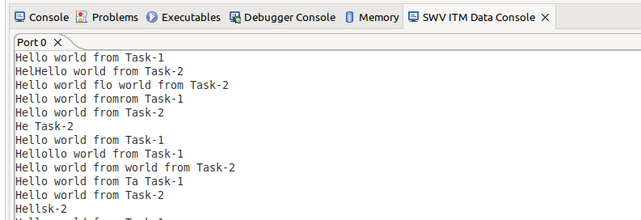
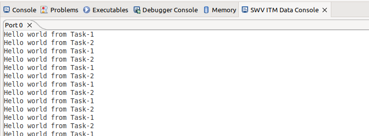
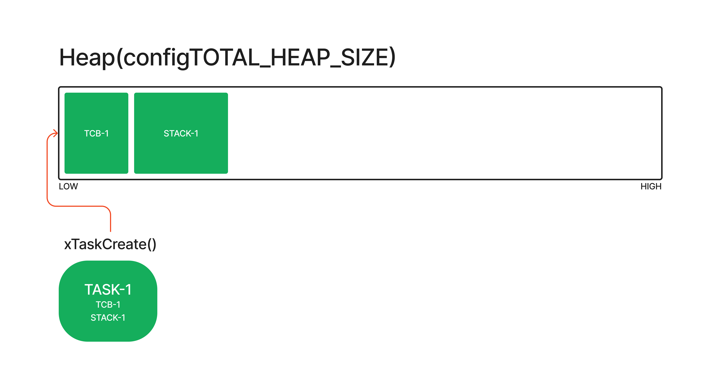
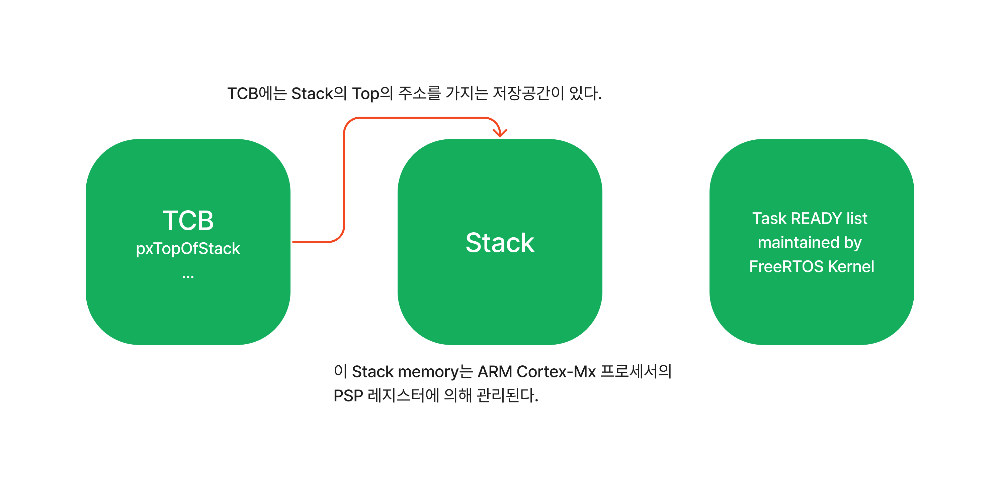

# Task creation

## Multitasking

`Multitasking Operating System`은 Single core processor가 한 번에 하나의 작업만 실행할 수 있음에도 불구하고 Task들 간에 빠른 전환을 통해 동시에 실행되는거 같은 환상을 보여줄 수 있다.


*(Image from freertos.org)*

## Scheduling

### Scheduler

`Scheduler`는 커널의 일부분으로 **특정 시간에 어떤 Task가 실행되어야 하는지를 결정하는 역할을 한다.**

### Scheduling policy

`Scheduling policy`는 `Scheduler`가 어떤 기준으로 특정 시점에 어떤 Task를 실행시켜야 하는지를 결정하는 알고리즘이다.

추가적으로 Task는 커널에 의해 `suspended`되는것 외에도 자발적으로 `suspended`되는 것이 가능하다. 예를들어 일정 시간 `delay(sleep)`이 필요하거나, 필요한 자원이 사용 가능해질때 까지 `wait(block)`하거나, `event`발생을 기다리는 경우 등이 해당된다.

- Pre-emptive scheduling
  - `FreeRTOSConfig.h`에 있는 `#define configTICK_RATE_HZ`의 값을 설정해주면서 preemptive되는 시간을 설정할 수 있다(task들의 우선순위가 같다면). (여기서 발생하는 RTOS ticks은 Systick timer의 interrupts이다.)
- Co-operative scheduling
  - `FreeRTOSConfig.h`에 있는 `#define configUSE_PREEMPTION` 값을 0으로 설정해주면 사용할 수 있고, 하나의 task가 종료되면, `taskYIELD()`를 호출하면서 task를 종료시켜줘야 다음 task가 실행된다.

## Context Switching

Task가 실행되면, Processor 혹은 Microcontroller의 레지스터들을 활용하고, RAM이나 ROM에 접근하는 등의 동작을 하는데, 이렇게 **Task가 실행하는 동안 사용하는 자원들이 Task execution context를 구성한다.**

Task라는 것은 언제 Kernel에 의해 `Suspended`되거나 `Resume`되는지 알 수 없는 코드의 조각이다. 그래서 어떤 일이 발생하면 실행하고 있던 상태를 기억해야 다음에 다시 `Resume`될 때 이전의 상태부터 다시 진행할 수 있다.

이런 역할을 OS의 Kernel이 해주고 있으며, **Suspended되기 바로 직전의 Task의 Context를 save해주는 역할을 하고,** 정지된 task가 다시 실행될 때, **저장된 context를 restore하는 역할 또한 Kernel의 역할이다.**

그리고 이 `suspended`되는 작업의 `context`를 저장하고, `resume`되는 task의 `context`를 `restore`하느 과정을 **Context Switching**이라고 한다.

## Task Creation

### TaskHandle_t

- task.h
Reference될 task의 타입을 나타낸다.

```C
TaskHandle_t task1_handle;
TaskHandle_t task2_handle;
```

### xTaskCreate

- task.h

```C
BaseType_t xTaskCreate( TaskFunction_t pxTaskCode,
                        const char * const pcName,
                        const configSTACK_DEPTH_TYPE usStackDepth,
                        void * const pvParameters,
                        UBaseType_t uxPriority,
                        TaskHandle_t * const pxCreatedTask )
```

새로운 task를 생성하고, 실행할 준비가 된 task들의 목록에 추가한다.
**`configSUPPORT_DYNAMIC_ALLOCATION`이 1로 설정되어 있어야 한다.**

각 task는 task의 `state`를 저장하고, task의 `stack`으로 사용하기 위해 **RAM을 필요로 한다.**

#### Parameters

- *pxTaskCode* : task entry function을 나타내고, 함수의 이름만 주면 된다.
- *pcName* : 디버깅에 유용하게 사용되며, task의 이름을 작성해주면 된다.
- *usStackDepth* : task의 `stack`에 할당될 `word`가 몇개인지를 설정해준다. (만약 32bit wide 스택에서 Depth가 400이면 4bytes * 400 = 1600bytes가 할당된다.)
- *pvParameters* : 생성된 task의 파라미터로 전달될 값을 작성.
- *uxPriority* : 생성된 task의 우선순위를 설정해준다.
- *pxCreatedTask* : 생성될 task의 `handle`을 전달해준다.

#### Returns

Task 생성이 성공적이면 `pdPASS`, 그렇지 않으면 `errCOULD_NOT_ALLOCATE_REQUIRED_MEMORY`가 반환된다.

#### Example

```C
// ...

BaseType_t status;

// ...
status = xTaskCreate(task1_handler, "Task-1", 200, "Hello world from Task-1", 2, &task1_handle);
configASSERT(status == pdPASS);
status = xTaskCreate(task2_handler, "Task-2", 200, "Hello world from Task-2", 2, &task2_handle);
configASSERT(status == pdPASS);

// ...

```

```C
static void task1_handler(void* parameters)
{
	while(1)
	{
		printf("%s\n", (char*)parameters);
		taskYIELD();  // for co-operative scheduling
	}
}

static void task2_handler(void* parameters)
{
	while(1)
	{
		printf("%s\n", (char*)parameters);
		taskYIELD();  // for co-operative scheduling
	}
}
```

#### Image

- Pre-emptive


- Co-operative


## How it works





