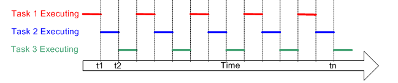

# Task creation

## Multitasking

`Multitasking Operating System`은 Single core processor가 한 번에 하나의 작업만 실행할 수 있음에도 불구하고 Task들 간에 빠른 전환을 통해 동시에 실행되는거 같은 환상을 보여줄 수 있다.

*(Image from freertos.org)*

## Scheduling

### Scheduler

`Scheduler`는 커널의 일부분으로 **특정 시간에 어떤 Task가 실행되어야 하는지를 결정하는 역할을 한다.**

### Scheduling policy

`Scheduling policy`는 `Scheduler`가 어떤 기준으로 특정 시점에 어떤 Task를 실행시켜야 하는지를 결정하는 알고리즘이다.

추가적으로 Task는 커널에 의해 `suspended`되는것 외에도 자발적으로 `suspended`되는 것이 가능하다. 예를들어 일정 시간 `delay(sleep)`이 필요하거나, 필요한 자원이 사용 가능해질때 까지 `wait(block)`하거나, `event`발생을 기다리는 경우 등이 해당된다.

