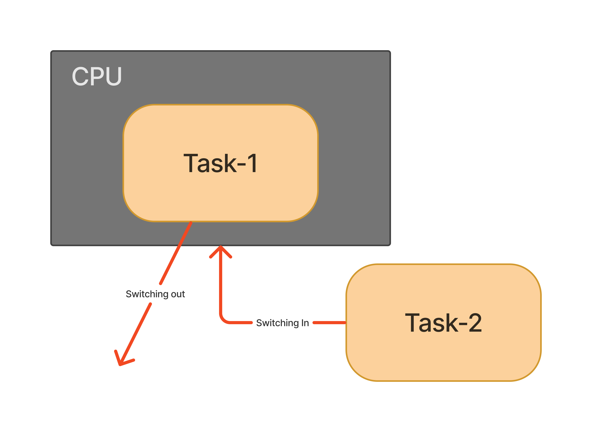
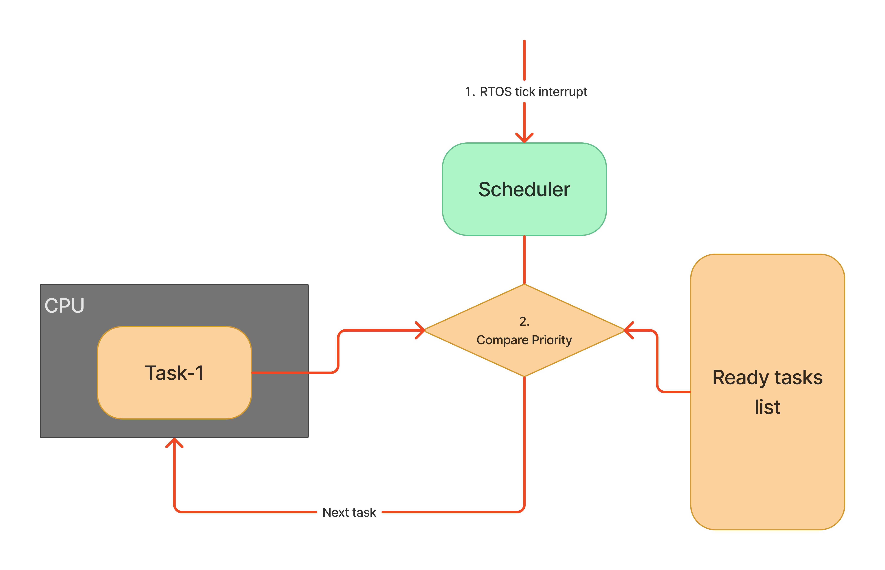
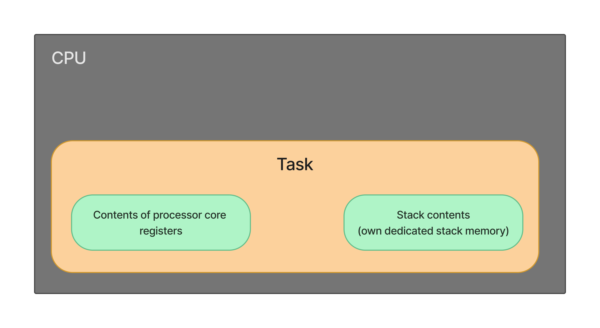
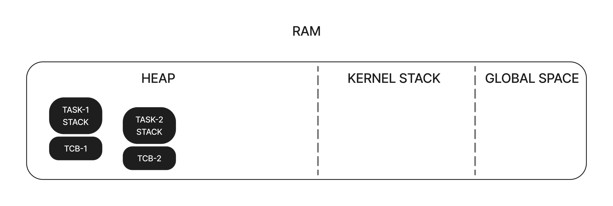
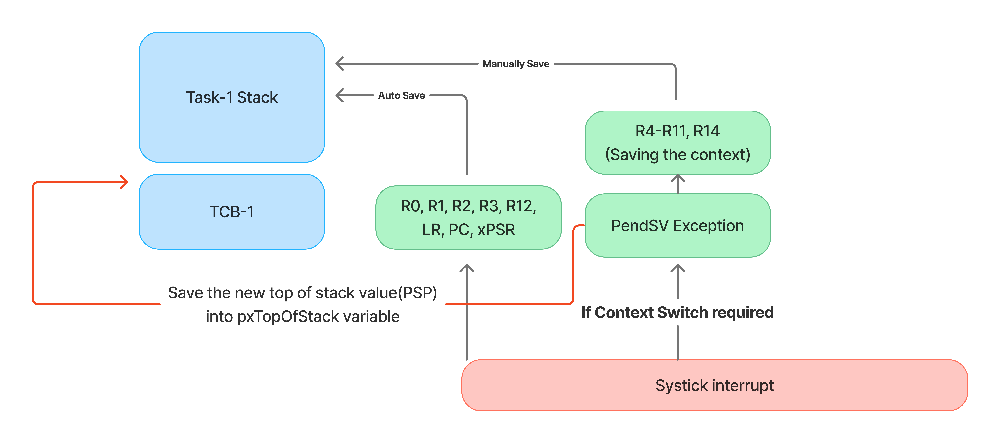

# Context Switching

*Context Switching*은 CPU에서 진행중이던 Task가 Switching out되고, 다른 Task가 Switching in 되는 과정을 뜻한다.

어떤 Task가 들어가는지는 `Scheduler`가 정하고, Context Switching의 과정은 `PendSV Handler`에서 일어난다.

Priority based pre-emptive scheduler의 동작 방식을 예로 들어보면

또는 `taskYIELD()`매크로를 사용하여 수동으로 `Context switch`를 발생시킬 수 있다.

그리고 새로운 task가 unblock할 때, 현재 진행중인 task보다 우선순위가 높으면 즉시 `Context Switch`가 발생한다.

## Task State

CPU에서 실행중인 Task는 다음과 같이 구성된다.

- Task가 CPU에서 실행되면서 사용하는 Register들
- Task의 Stack 메모리 공간

이것들을 Task의 **State**라고 한다.

## Stack memories

### Task's private stack(Process stack)

- 이 Stack에서 일어나는 push, pop 연산은 ARM의 `PSP` Register에 의해서 추적된다.
- Task가 실행될 때, PUSH, POP연산은 이 Stack 메모리에서 일어난다.

### Kernel stack(Main stack)

- 이 Stack에서 일어나는 PUSH, POP 연산은 ARM의 `MSP` 레지스터에 의해 추적된다.
- ISR이 실행될 때, PUSH, POP 연산은 여기서 일어난다.

### Memory overview

## Task Switching Out

### Saving context

빨간줄의 경우에 현재 CPU에서 진행되고 있던 Register인 SP 레지스터를 확인하여 PSP 값을 가져와 `TCB`의 첫번째 변수인 `pxTopOfStack`에 넣어준다.

이후 위의 과정을 통해 저장을 마치면, 다음 가능한 Task를 CPU에서 실행시킨다. `vTaskSwitchContext()` 함수를 통해 실행되며, 이는 다음 Task TCB의 포인터를 가져오는 작업을 담당한다.

## Task Switching In

이미 다음 Task(TCB)가 정해졌다고 가정하면, `pxCurrentTCB`를 통해 새로운 switch 가능한 task의 TCB에 접근 가능하다는 의미이다.

- 다음 Task의 TCB에서 `pxTopOfStack` 값을 PSP 레지스터에 넣어준다.
- **Restoring the context**작업을 해준다. Task의 Stack 메모리에서 R4-R11, R14 레지스터 값을 POP 하여 불러온다.
- 이후 `PendSV Handler`가 종료되면서 나머지 (R0, R1, R2, R3, R12, LR, PC, xPSR) 레지스터들이 POP되면서 자기 자리를 찾아간다.

실제 `PendSV` 인터럽트 처리문을 보면 코드의 구성이 `Context Saving -> Context restoring` 형식으로 되어있다.
