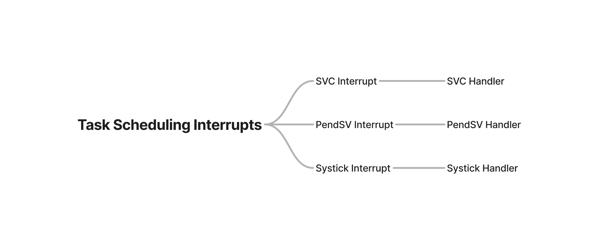
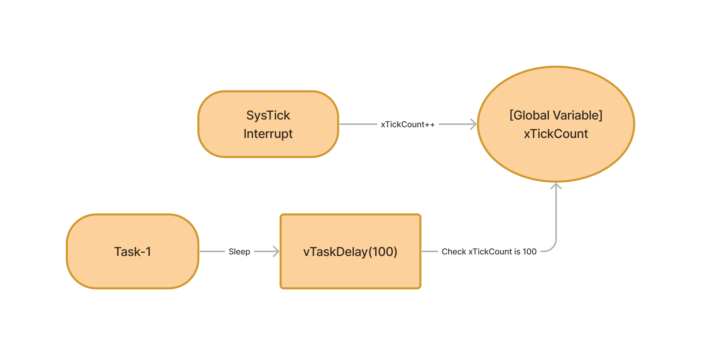
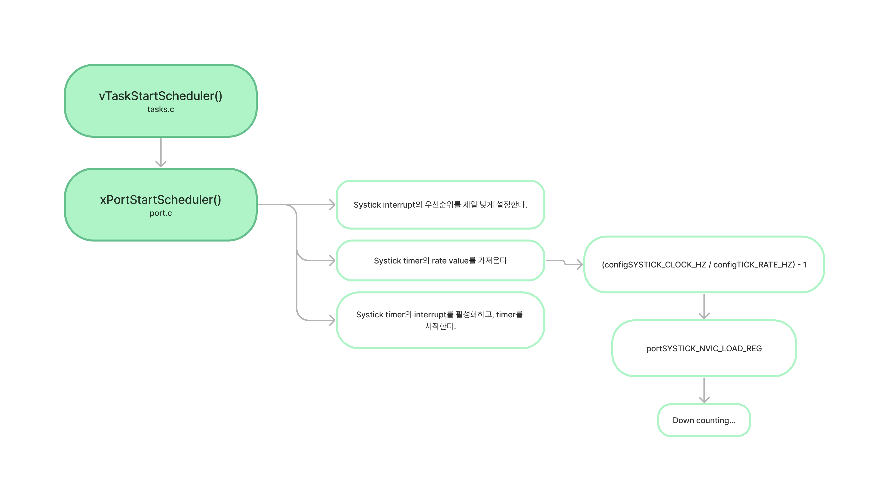
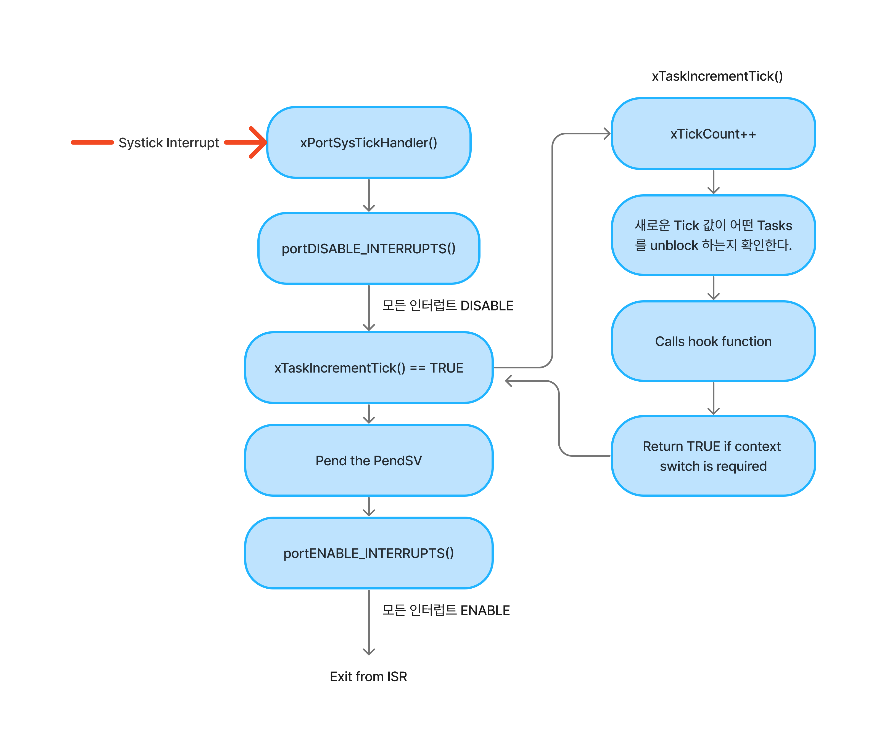

# FreeRTOS Kernel Interrupts

Task Scheduling을 위해 사용되는 인터럽트들은 다음과 같다.



3개의 인터럽트 모두 `HW 인터럽트`이다. 모두 가능한 **제일 낮은 우선순위로 만들어진다.**

## RTOS Tick and SysTick Timer

```C
#define configTICK_RATE_HZ  ((PortTickType) 1000)
```

`config`파일에 보면 이런 define문을 확인할 수 있다. `Systick`에 의해 인터럽트가 **1ms**마다 발생한다.

### Why use it?

예를들어 Task-1이 CPU에 영향을 주지 않고, Sleep(Delay)하는 방법을 생각해보면 다음과 같이 Systick Timer를 사용할 수 있다.



또한 `RTOS Tick`의 주요 사용처는 다음 `Potential Task`와의 **Context Switching**을 위해서 사용된다.

## Configure RTOS Tick timer



## RTOS tick ISR flow


