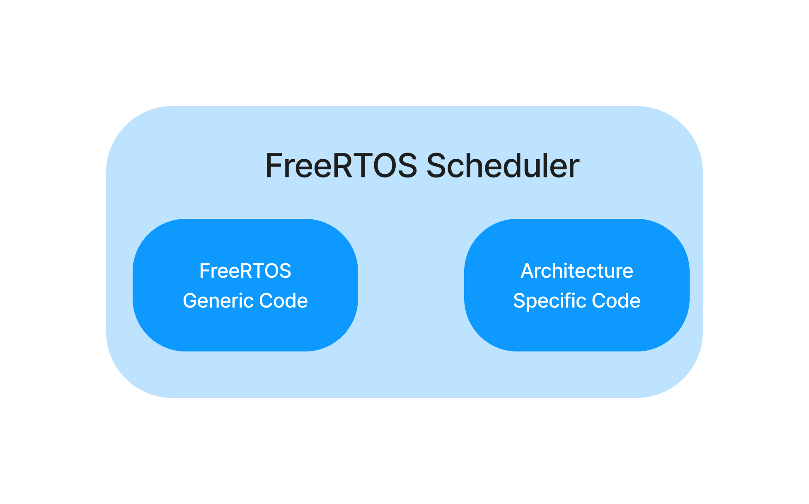
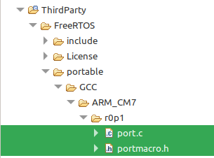
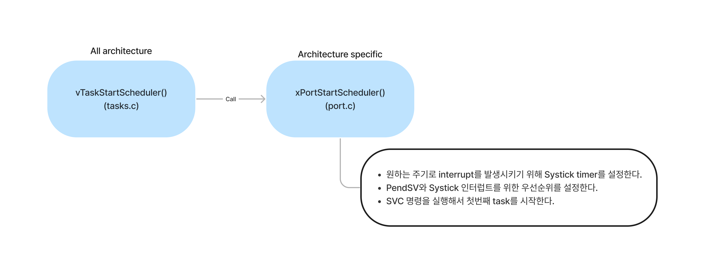

# FreeRTOS Scheduler

## Implementation

*FreeRTOS Scheduler*는 `tasks.c`파일에 있는 *FreeRTOS Generic Code*와 ARM Cortex-Mx 같은 Architecture에 따른 코드가 있는 `port.c` 파일에 있는 *Architecture Specific Code*로 구성되어있다.

그리고 대부분의 architecture specific code들은 `port.c`와 `portmacro.h`파일에 구현되어 있다.

## Interrupts for Scheduling Tasks

Task들을 Scheduling하기 위해 필요한 인터럽트들을 알아보자

- `vPortSVCHandler()` : 제일 처음 task를 실행할 때 사용된다.
- `xPortPendSVHandler()` : Task들 사이에 **Context Switching**이 일어나는 인터럽트이다.
- `xPortSystickHandler()` : **RTOS Tick**을 구현한다.

## Start Scheduler

