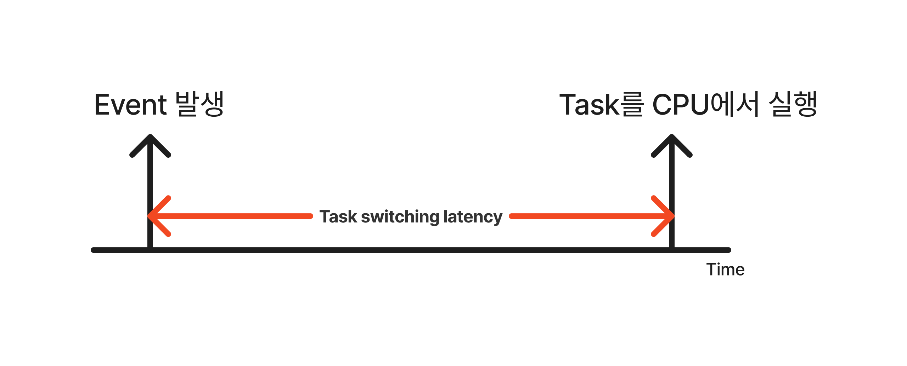
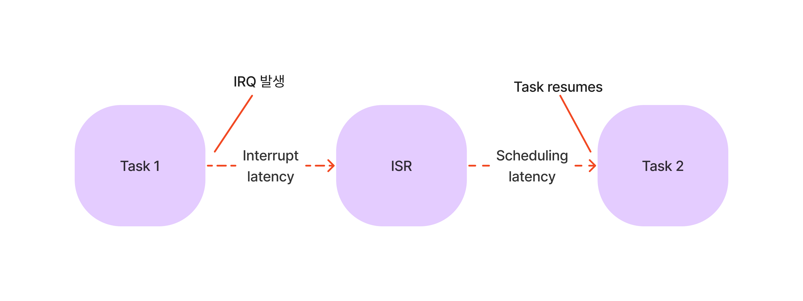

# RTOS and GPOS

## GPOS?

General Purpose Operating System
- Windows
- Linux
- MacOS
- etc...

## RTOS

Real Time Operating System
- VxWorks
- FreeRTOS
- etc...

## Key features of RTOS

- 인터럽트나 내부 시스템 예외에 대한 처리
- Critical sections들에 대한 처리
- Scheduling mechanism
- etc...

## GPOS vs RTOS : Task scheduling

목적의 차이가 있다. GPOS의 Task scheduling의 주된 목적은 **높은 처리량(High throughput)** 이다.
반면에 RTOS는 **높은 우선순위를 가진 Thread가 CPU 사용에 대한 우선권을 가지고, 우선순위가 낮은 Thread를 밀어내고 CPU를 차지하는 구조** 를 가진다. 이때 밀려난 Thread는 Pause상태가 된다.

하지만 이것만 보고는 GPOS의 처리량이 RTOS의 처리량보다 좋다고 말할 수 없다.

## GPOS vs RTOS : Latency

### Task switching latency

GPOS의 경우에는 이 Task switching latency가 다양하다.
반면에 RTOS는 **거의 일정하다.**

### Interrupt latency

`Interrupt latency`는 Interrupt trigger 부터 service routine이 CPU에 실행되는 시점까지의 시간이다.

`Scheduling latency`는 Context switching 실행에 걸리는 시간을 의미한다.

`Interrupt latency`와 `Scheduling latency`는 모두 RTOS에서는 **최대한 작아야하고, 시간이 제한적(Time bounded)이어야 한다.**
반면에 GPOS는 이 시간들이 모두 다양하다.

