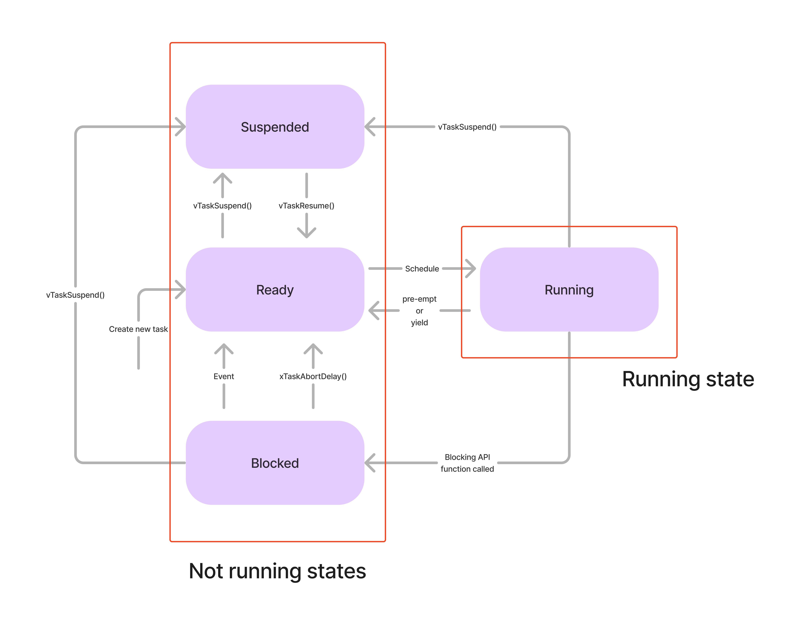

# Task States

## States

### About states

- Running : Task가 현재 processor에서 실행중인 상태를 뜻한다.
- Ready : Scheduler가 schedule하면 CPU에서 실행 가능한 Task의 상태를 뜻한다. FreeRTOS에서는 **새로운 Task가 생성되면 항상 Ready state로 들어간다.**
- Blocked : Task가 CPU에서 나갈 수 있으며,(*즉 CPU에서 실행중일때만 들어갈 수 있는 상태이다.*) **어떤 내부 혹은 외부 이벤트를 만나기 전까지는 CPU에서 돌아가지 않도록 선택할 수 있다.** CPU시간을 잡아먹지 않으며, **timeout period**를 설정할 수 있다.
- Suspended : Task 자체 혹은 다른 Task가 `vTaskSuspend(task_handle)`을 호출했을 때 들어갈 수 있다. Resume하려면, 다른 Task가 `vTaskResume()`을 호출해주어야 한다. Block과는 다르게 **Timeout period도 존재하지 않는다.**
