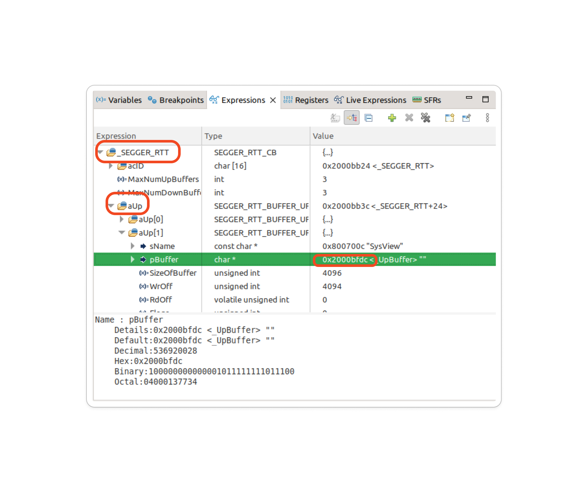
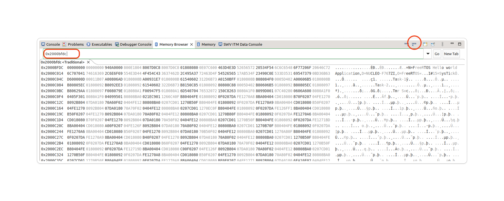
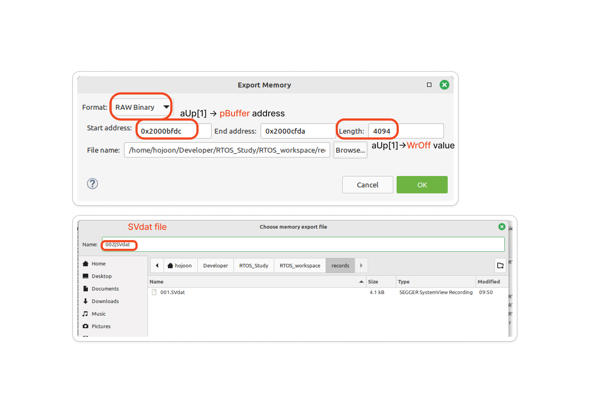
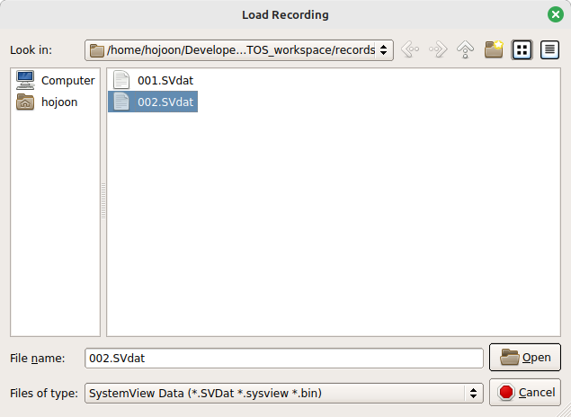
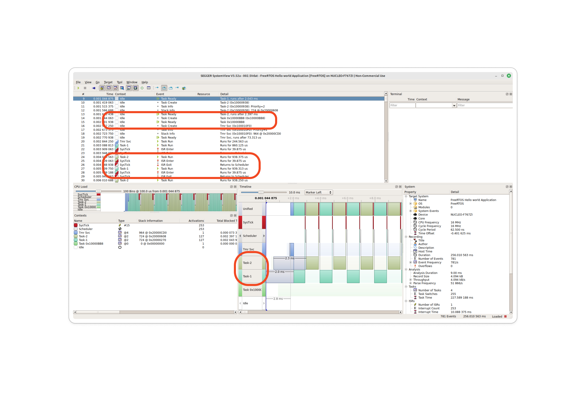

# Using SEGGER SystemView

## Path configure

```
├── Project
│   ├── ThirdParty
│   │   ├── SEGGER
|   |   |   ├── Config
|   |   |   |   ├── Global.h
|   |   |   |   ├── SEGGER_RTT_Conf.h
|   |   |   |   ├── SEGGER_SYSVIEW_Conf.h
|   |   |   |   └── SEGGER_SYSVIEW_Config_FreeRTOS.c
|   |   |   ├── OS
|   |   |   |   ├── SEGGER_SYSVIEW_FreeRTOS.c
|   |   |   |   └── SEGGER_SYSVIEW_FreeRTOS.h
|   |   |   └── SEGGER
|   |   |   |   ├── Syscalls
|   |   |   |   |   └── SEGGER_RTT_Syscalls_GCC.c
|   |   |   |   ├── SEGGER.h
|   |   |   |   ├── SEGGER_RTT.c
|   |   |   |   ├── SEGGER_RTT.h
|   |   |   |   ├── SEGGER_RTT_ASM_ARMv7M.S
|   |   |   |   ├── SEGGER_RTT_printf.c
|   |   |   |   ├── SEGGER_SYSVIEW.c
|   |   |   |   ├── SEGGER_SYSVIEW.h
|   |   |   |   ├── SEGGER_SYSVIEW_ConfDefaults.h
|   |   |   |   └── SEGGER_SYSVIEW_Int.h
```

## Setup

- Scheduling policy : Pre-emption

```C
int main(void)
{
  // ...
  	// Enable CYCCNT
	DWT_CTRL |= (1 << 0);

	SEGGER_SYSVIEW_Conf();
	SEGGER_SYSVIEW_Start();

	status = xTaskCreate(task1_handler, "Task-1", 200, "Hello world from Task-1", 2, &task1_handle);
	configASSERT(status == pdPASS);
	status = xTaskCreate(task2_handler, "Task-2", 200, "Hello world from Task-2", 2, &task2_handle);
	configASSERT(status == pdPASS);
  // ...
}
```

```C
// in FreeRTOSConfig.h

// at the end of the file
#include "SEGGER_SYSVIEW_FreeRTOS.h"

#endif /* FREERTOS_CONFIG_H */
```

## Debugging

### Prepare data for System View in STM32CubeIDE

- 디버깅 -> Resume(F8) -> 몇초 후 Suspend.

- `Expressions` window에서 `_SEGGER_RTT`를 추가한다.



- `aUp` -> `aUp[1]` -> `pBuffer`의 주소 *(0x2000bfdc)* 를 가져온다.

- 이후 `Memory Browser` window에서 해당 주소를 검색한다.



우측 상단에 `Export`를 누르고, 다음의 설정을 해주고 저장해준다.



### Load data in System View

이제 *System View*에서 Load 해주면 된다.



저장했던 파일을 열고, 데이터를 확인해보면 `Task-1`과 `Task-2`에 관련된 여러 데이터들을 확인할 수 있다.



`Task-2`의 `Run` 이벤트, ISR Enter, ISR Exit, `Task-1` 의 `Run` ... 등을 Timeline을 통해 확인할 수 있다.
